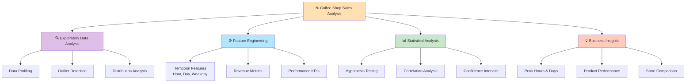
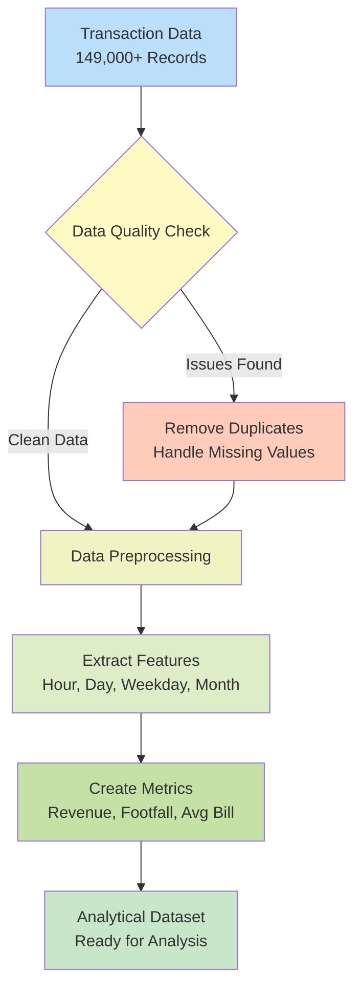
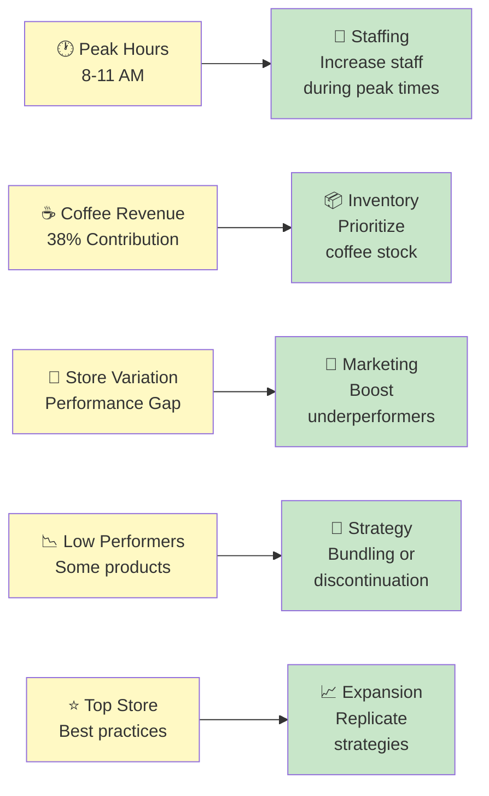

# ☕ Coffee Shop Sales Analysis – Data Analytics Project

A comprehensive data analytics project exploring **149,000+ coffee shop transactions** from three NYC locations. This analysis uncovers critical business insights through statistical analysis, exploratory data analysis, and rich visualizations to drive decision-making.

## 📌 Project Overview

This project performs a deep-dive analysis of real-world simulated coffee shop sales data to answer key business questions:

- **When do customers visit the most?** - Identify peak hours and busy periods
- **Which products drive revenue?** - Analyze product performance and contribution
- **How do sales vary across stores?** - Compare store performance metrics
- **What temporal patterns exist?** - Discover weekday, hourly, and seasonal trends
- **Are observed patterns statistically significant?** - Validate assumptions with statistical tests

By transforming raw transaction data into actionable business intelligence, this project enables data-driven decision-making for inventory management, staffing, and marketing strategies.

## 📂 Dataset

| Attribute | Details |
|-----------|---------|
| **Records** | 149,000+ transactions |
| **Locations** | 3 store locations in NYC |
| **Time Period** | Historical transaction data |
| **Features** | Transaction timestamps, product categories, items, quantities, unit prices, revenue |
| **Data Quality** | Cleaned, with missing values handled and features engineered |

**Data Preprocessing:**
- DateTime conversion and validation
- Handling missing and duplicate values
- Feature extraction (hour, day, weekday, month, revenue calculations)
- Categorical encoding where necessary

## 🛠️ Tech Stack

| Tool | Purpose |
|------|---------|
| **Python** | Core language |
| **Pandas** | Data manipulation & analysis |
| **NumPy** | Numerical computing |
| **Matplotlib** | Data visualization |
| **Seaborn** | Statistical visualization |
| **SciPy** | Statistical analysis & hypothesis testing |
| **Jupyter** | Interactive analysis & documentation |
| **Openpyxl** | Excel file support |

## 📊 Key Features & Analysis

### 🎯 Analysis Scope Diagram



### 🔹 **Data Exploration**
- Comprehensive data profiling (shape, types, distributions)
- Missing value analysis and handling strategies
- Outlier detection and treatment
- Descriptive statistics by store and product category

### 🔹 **Feature Engineering**
- Temporal features: Hour, day, weekday, month extraction
- Revenue metrics: Total revenue, average bill per transaction
- Performance indicators: Sales count, footfall, product contribution percentages
- Store-specific KPIs and year-over-year comparisons

### 🔹 **Exploratory Data Analysis (EDA)**
- **Revenue Trends**: Time-series analysis of daily, weekly, and monthly patterns
- **Product Performance**: Top-selling products and category-wise revenue breakdown
- **Store Comparison**: Performance metrics across all locations
- **Temporal Patterns**: Hour vs. weekday heatmaps revealing peak business hours
- **Category Analysis**: Revenue and volume distribution by product type

### 🔹 **Statistical Analysis**
- **Hypothesis Testing**: T-tests to validate significant differences in:
  - Sales performance across different days
  - Customer spending patterns across time periods
  - Store performance disparities
- **Correlation Analysis**: Relationships between variables
- **Confidence Intervals**: Range estimates for key metrics

### 🔹 **Business Insights Discovered**
- ✅ **Peak Sales Period**: Friday mornings record the highest transaction volume
- ✅ **Revenue Leader**: Coffee category contributes ~38% of total revenue
- ✅ **Golden Hours**: Peak transaction hours fall between **8 AM – 11 AM**
- ✅ **Store Performance**: One location consistently outperforms others in both revenue and footfall
- ✅ **Seasonal Patterns**: Identifiable weekly and monthly trends for better forecasting
- ✅ **Product Mix**: Strategic product recommendations based on performance data

## 📁 Project Structure

```
coffee-shop-sales/
├── Coffee Shop Sales (1).ipynb    # Main analysis notebook
├── coffee.py                      # Utility functions for data processing
├── requirements.txt               # Python dependencies
├── README.md                      # Project documentation
└── data/                          # Dataset directory
    └── .gitkeep
```
### 📊 Project Workflow Diagram

```mermaid
graph LR
    A["📥 Raw Data<br/>(CSV/XLSX)"] -->|Data Loading| B["🔧 Data Cleaning<br/>(Handle Missing Values)"]
    B -->|Validation| C["⚙️ Feature Engineering<br/>(Extract Hour, Day, etc.)"]
    C -->|Preprocessing| D["📊 Exploratory Analysis<br/>(EDA)"]
    D -->|Statistical Methods| E["📈 Analysis<br/>(Revenue, Trends, etc.)"]
    E -->|Hypothesis Testing| F["✅ Insights & Recommendations<br/>(Business Decisions)"]
    
    style A fill:#e1f5ff
    style B fill:#fff3e0
    style C fill:#f3e5f5
    style D fill:#e8f5e9
    style E fill:#fce4ec
    style F fill:#c8e6c9
```



### 🔄 Data Processing Flow



### 📋 Analysis Pipeline

```mermaid
graph LR
    subgraph Data["📊 Data Phase"]
        D1["Load Data"]
        D2["Clean & Validate"]
        D3["Feature Engineering"]
    end
    
    subgraph EDA["🔍 Exploration Phase"]
        E1["Descriptive Stats"]
        E2["Distribution Analysis"]
        E3["Correlation Study"]
    end
    
    subgraph Analysis["📈 Analysis Phase"]
        A1["Revenue Trends"]
        A2["Product Performance"]
        A3["Store Comparison"]
        A4["Temporal Patterns"]
    end
    
    subgraph Testing["📊 Statistical Phase"]
        T1["Hypothesis Testing"]
        T2["Significance Tests"]
        T3["Confidence Intervals"]
    end
    
    subgraph Output["✅ Insights Phase"]
        O1["Key Findings"]
        O2["Business Recommendations"]
        O3["Visualizations"]
    end
    
    D1 --> D2 --> D3 --> E1
    E1 --> E2 --> E3 --> A1
    A1 --> A2 --> A3 --> A4 --> T1
    T1 --> T2 --> T3 --> O1
    O1 --> O2 --> O3
    
    style Data fill:#e3f2fd
    style EDA fill:#f3e5f5
    style Analysis fill:#e8f5e9
    style Testing fill:#fff3e0
    style Output fill:#fce4ec
```


## 🚀 Getting Started

### Prerequisites
- Python 3.8 or higher
- pip package manager

### Installation

1. **Clone the repository**
   ```bash
   git clone https://github.com/HR07xx/Coffee-Shop-Sales-Dashboard.git
   cd Coffee-Shop-Sales-Dashboard
   ```

2. **Create a virtual environment (optional but recommended)**
   ```bash
   python -m venv venv
   # On Windows
   venv\Scripts\activate
   # On macOS/Linux
   source venv/bin/activate
   ```

3. **Install dependencies**
   ```bash
   pip install -r requirements.txt
   ```

4. **Add dataset**
   - Place your `coffee_shop_sales.csv` or `coffee_shop_sales.xlsx` file in the `data/` directory
   - The script will automatically locate and load the file

### Running the Analysis

1. **Option A: Interactive Notebook** (Recommended for exploration)
   ```bash
   jupyter notebook "Coffee Shop Sales (1).ipynb"
   ```

2. **Option B: Python Script**
   ```bash
   python coffee.py
   ```

## 📖 Analysis Walkthrough

The Jupyter notebook is organized into logical sections:

1. **Data Loading & Overview** - Load dataset and initial exploration
2. **Data Cleaning** - Handle missing values, validate data types, remove duplicates
3. **Exploratory Data Analysis** - Statistical summaries and initial visualizations
4. **Revenue Analysis** - Time-series trends, product performance, category breakdown
5. **Temporal Patterns** - Hourly and weekday analysis with heatmaps
6. **Store Comparison** - Performance metrics across locations
7. **Statistical Testing** - Hypothesis validation and significance testing
8. **Conclusions & Recommendations** - Actionable insights and business recommendations

## 📈 Sample Visualizations

The analysis includes numerous visualizations:
- Revenue trends over time (line charts)
- Top-selling products (bar charts)
- Store-wise performance comparison
- Product category distribution (pie/donut charts)
- Hour vs. weekday heatmaps
- Statistical test results with confidence intervals

## 💡 Key Recommendations

### 📊 Insights to Actions Flow



Based on the analysis:
1. **Staffing**: Increase staff during peak hours (8-11 AM) especially on Fridays
2. **Inventory**: Prioritize coffee stock given its revenue contribution
3. **Marketing**: Target promotions for underperforming stores
4. **Product Mix**: Evaluate low-performing products or consider strategic bundling
5. **Expansion**: Replicate strategies from the highest-performing store

## 📝 Dependencies

All required packages are listed in `requirements.txt`:
- pandas ≥ 2.0.0
- numpy ≥ 1.24.0
- matplotlib ≥ 3.7.0
- seaborn ≥ 0.13.0
- scipy ≥ 1.11.0
- jupyter ≥ 1.0.0
- openpyxl ≥ 3.1.0

## 🤝 Contributing

Contributions are welcome! If you'd like to enhance this analysis:
1. Fork the repository
2. Create a feature branch (`git checkout -b feature/improvement`)
3. Commit your changes (`git commit -am 'Add new analysis'`)
4. Push to the branch (`git push origin feature/improvement`)
5. Open a Pull Request

## 📄 License

This project is provided as-is for educational and analytical purposes.

## 📧 Questions & Support

For questions, issues, or suggestions, feel free to open an issue on GitHub or contact the project maintainers.

---

**Last Updated:** 2026  
**Project Status:** ✅ Complete & Documented

Open the Jupyter Notebook

jupyter notebook

🧠 What I Learned

Cleaning & wrangling large datasets

Feature engineering for business KPIs

Creating meaningful and aesthetic data visualizations

Applying statistical tests (t-tests)

Presenting insights using data storytelling

📜 License

This project is open-source and available under the MIT License.
=======
# Coffee Shop Sales Analysis

A data analysis project focused on understanding coffee shop performance across multiple NYC store locations. The project explores sales trends, customer behavior, product performance, and operational insights using Python, Pandas, Matplotlib, Seaborn, and SciPy.

## Project Overview

This analysis is built around transaction-level sales data from a coffee shop business. It examines:

- sales performance across stores and dates
- peak business hours and busiest days
- product and category revenue contribution
- customer behavior patterns over time
- distributions and trend analysis using statistical methods

The project is designed to turn raw transaction data into business-friendly insights that can inform pricing, staffing, inventory, and marketing decisions.

## Dataset

The project uses transactional coffee shop sales data with fields such as:

- transaction_id
- transaction_date
- transaction_time
- store_id
- store_location
- product_id
- transaction_qty
- unit_price
- product_category
- product_type
- product_detail
- size
- total_bill
- month/day/hour-derived features

The data is expected to be placed in the `data/` directory as either:

- `data/coffee_shop_sales.xlsx`
- `data/coffee_shop_sales.csv`

If your file uses a different name, update the path in the analysis script accordingly.

## Business Questions Explored

- Which products generate the most revenue?
- Which days and hours have the highest sales volume?
- Which store location performs best?
- How do customer purchasing patterns vary by time and category?
- Are there statistically significant differences in spending patterns across periods?

## Tools and Libraries

- Python
- Pandas
- NumPy
- Matplotlib
- Seaborn
- SciPy
- Jupyter Notebook

## Repository Structure

```text
coffee-sales/
├── README.md
├── coffee.py
├── requirements.txt
├── .gitignore
├── data/
│   └── coffee_shop_sales.xlsx
└── .ipynb_checkpoints/
```

## Setup and Installation

1. Clone the repository:

```bash
git clone https://github.com/HR07xx/Coffee-Shop-Sales-Analysis.git
cd Coffee-Shop-Sales-Analysis
```

2. Create and activate a virtual environment (recommended):

```bash
python -m venv .venv
```

On Windows:

```bash
.venv\Scripts\activate
```

On macOS/Linux:

```bash
source .venv/bin/activate
```

3. Install dependencies:

```bash
pip install -r requirements.txt
```

4. Add your dataset to the `data/` folder.

5. Run the analysis script:

```bash
python coffee.py
```

If the notebook version is preferred, open the Jupyter notebook and execute the cells in order.

## Important Note on Data Loading

The original script was using a hardcoded absolute Windows path. That is not portable across machines or GitHub environments. To make the project reusable, the dataset should be stored in a project-relative path such as:

```python
from pathlib import Path

data_path = Path("data") / "coffee_shop_sales.xlsx"
```

This allows the project to run consistently on other computers and in shared environments.

## Expected Insights

The analysis typically reveals:

- revenue concentration by product category
- strongest-performing store locations
- peak sales windows by weekday and hour
- high-contribution products and bundles
- opportunities for promotions based on demand trends

## License

This project is open for educational and analytical use. If you plan to publish or reuse it, add an appropriate license file as needed.

## Future Improvements

- add cleaned CSV exports for reusable analysis
- create reusable plotting functions
- build an interactive dashboard
- automate report generation for stakeholders
- add more advanced KPI summaries and forecasting

## Author

- HR07xx
>>>>>>> 4c1943f (Improve README and project setup)
